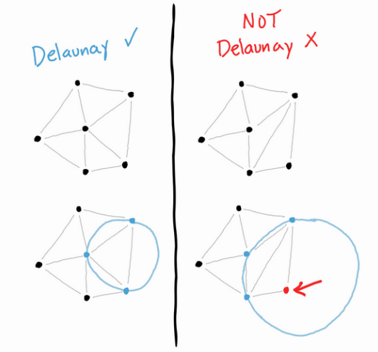
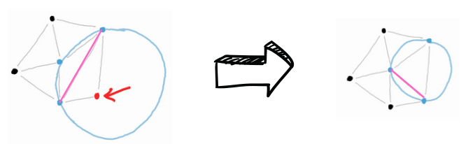
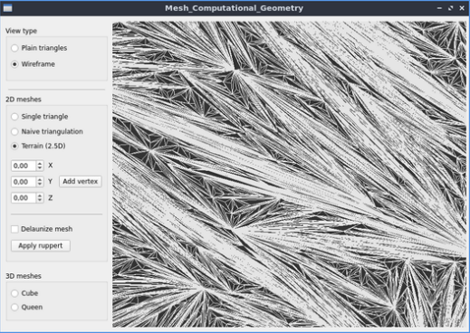
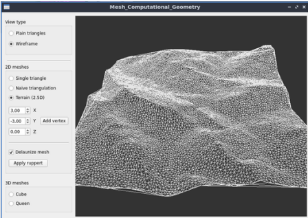
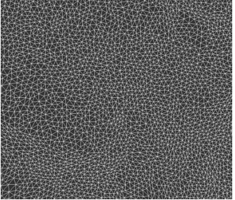

# Mesh Refinement software - Autumn 2023

This software was an assignment project for our Geometry algorithms class during my second year of Master's degree.

The starting code consisted of a window with only a GL module from Qt Creator.

## Work done

We've implemented the following features :
- Mesh loading from .off files
- Delaunay criterion evaluation
- Lawson's algorithm
- Ruppert's algorithm
- Graphical User Interface for using the previous features

## Implemented algorithm details
This section is a short version of the french report available in the root folder of the repository.

### Delaunay criterion

The (2D) delaunay criterion is as follow : "if the circumcircle of a triangle has another vertex in it, it violates the criterion. Otherwise, it enforces it."
Respectively in 3D, with a sphere instead of a circle. But this is out of the scope of this application.

### Lawson's algorithm

To enforce the delaunay criterion in a whole mesh, we used Lawson's algorithm. 

By "fliping" an edge, we can enforce delaunay between two non-delaunay adjacent faces. This can however create other delaunay violations in nearby faces. 
At each iteration of the algorithm, we flip all the edges between non-delaunay faces.
This algorithm's completion is ensured by the strictly increasing mesh's quality in regards to the criterion.

### Ruppert's algorithm

This one is a way of increasing the quality of an already Delaunay-enforced mesh. Triangles are split in 2 until all angles in the mesh are bellow a threshold.

## Results

By combining these algorithms, we achieved the following mesh refinement : 

Here is a mesh formed of a naive insertion of vertices, resulting in stretched faces.

Using the previous algorithms, we end up with the following refined mesh :

